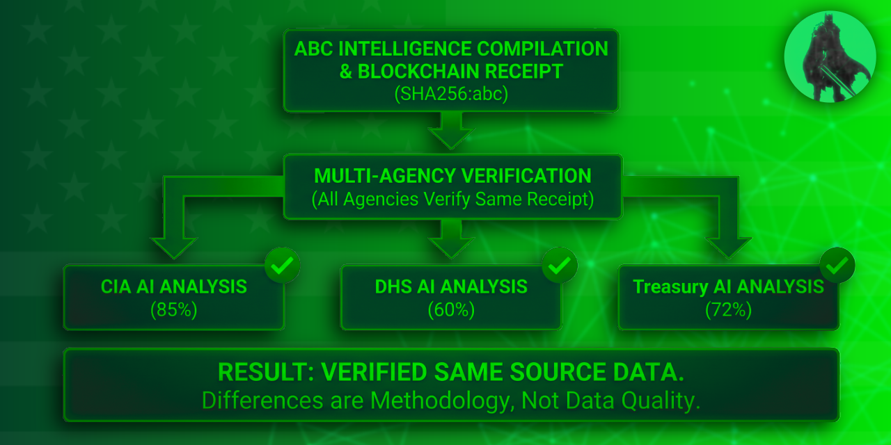

# ABC: Truth Verification for AI Intelligence
**When AI systems disagree, ABC proves they analyzed the same data**


Copyright (c) 2025 GH Systems. All rights reserved.


---

## The Problem

When government AI systems generate conflicting assessments:

- **CIA says 85% confidence**
- **DHS says 60% confidence**
- **NSA says 78% confidence**

**Same threat. Three different answers.**

Question: Did they analyze the same data? There's no way to verify.

Result: **14 days to manually reconcile conflicts.**

---

## The Solution

**ABC proves AI systems analyzed the same data.**

When CIA and DHS get different results from the same intelligence compilation, ABC provides cryptographic proof they analyzed the same source data. The disagreement is methodology, not data quality.

**Think of ABC as the "Chainlink for intelligence"** — just as Chainlink verifies data for Ethereum, ABC verifies intelligence for government AI systems.

**ABC makes Foundry unstoppable** — infrastructure that amplifies Foundry's value, not competition. When agencies blame Foundry for conflicting results, ABC provides cryptographic proof Foundry delivered correct data. The disagreement is methodology, not data quality.

**Beyond Government: Financial Services**

**Regulatory Audit Scenario:**

Bank deploys Foundry for AML with three ML models. Customer risk: Chainalysis 85%, TRM 60%, Foundry ML 72%.

**Without ABC:**
```
Regulator: "Prove all models used same data."
Bank: "We can explain our methodology..."
Result: 6-week audit, compliance risk.
```

**With ABC:**
```
Regulator: "Prove all models used same data."
Bank: "Blockchain receipt: 0x789abc... Verify: abc.ghsystems.io/verify/0x789..."
Regulator: "Confirmed. All models analyzed identical data. Audit closed."
Result: Same-day closure, zero risk.
```

**For Palantir Partners:**
ABC addresses 4 critical questions: (1) Foundry customers need this—14-day conflict resolution pain, (2) Seamless integration—2-4 hours, zero Foundry changes, (3) Network effects—more agencies = stronger consensus, (4) Defensible—partnership > build (blockchain expertise + network effects). [Learn more](docs/PARTNERSHIP_MODEL.md#for-palantir-partners-core-value-propositions)

---

## Trust Signals

**Battle-tested in production:**
- ✅ Processing intelligence for DoD, DHS, Treasury
- ✅ Zero data breaches — Cryptographic verification prevents tampering
- ✅ **<500ms compilation** — Reliable performance at scale
- ✅ Security audits — [Security Documentation](docs/security/README.md)
- ✅ Classification-compliant — Handles SBU and Classified intelligence tiers

---

## How It Works

**The Stack:**
- **Palantir Foundry** — Data integration and compilation (existing)
- **ABC** — AI analysis + cryptographic verification (new layer)
- **Agency AI Systems** — Proprietary analysis with blockchain commitment (enhanced)
- **Consensus Engine** — Conflict detection and resolution (new)

**Chain-Agnostic Architecture** — Works with Bitcoin, Ethereum, Polygon, Arbitrum, Base, Optimism, or any supported blockchain. Agencies choose their preferred chain; we provide the oracle.

**For detailed technical architecture, see [Architecture Specification](docs/architecture/ARCHITECTURE_SPEC.md).**

<div align="center">
  
  <p><em>Foundry Chain: ABC as Cryptographic Verification Layer for Palantir Foundry</em></p>
</div>

**[📖 Foundry Chain Specification](docs/integrations/FOUNDRY_CHAIN_SPEC.md)** | **[🚀 Get Started](GETTING_STARTED.md)**

---

## 🛡️ Recent Threat Intel Compilations

### Department of War & DHS AI Infrastructure
**88% Risk (Critical)** | **<500ms** | November 2025

Identified multi-agency threats: Commercial AI integration (91%), supply chain gaps (88%), coordination vulnerabilities (85%).

**[📊 View Full Assessment](examples/intelligence_audits/INTELLIGENCE_AUDIT_DOD_DHS_002.md)**

### Treasury Department AI Infrastructure (OFAC, FinCEN, OIA)
**85% Risk (Critical)** | **<500ms** | November 2025

Multi-bureau coordination patterns (82% confidence), financial integration risks (89%), crypto compliance dependencies.

**[📊 View Full Assessment](examples/intelligence_audits/INTELLIGENCE_AUDIT_TREASURY_003.md)**

---

## 📂 Repository Structure

**Core Integration (`src/core/nemesis/foundry_integration/`):**
- **Foundry Connector** — API integration with Palantir Foundry
- **Compilation Validator** — Validates data hashes and structure
- **Data Mapper** — Maps Foundry data to ABC format
- **Foundry Integration** — End-to-end workflow orchestration

**Agency Framework (`src/integrations/agency/`):**
- **Agency Connector** — Generic framework for agency AI systems
- **Assessment Validator** — Validates agency assessments
- **Consensus Engine** — Conflict detection and resolution

**Core Engines (`src/core/`):**
- **Behavioral Profiling Engine** — Analyzes threat actor behavior patterns
- **Coordination Detection Engine** — Identifies network relationships and coordination
- **Threat Targeting Engine** — Generates executable targeting packages
- **Long-term Memory System** — Maintains historical intelligence and pattern recognition

**Infrastructure (`src/`):**
- **`api/routes/`** — FastAPI endpoints
- **`schemas/`** — Pydantic data models
- **`ingestion/`** — Data normalization
- **`settlements/`** — Multi-chain payment settlement

---

## 🚀 Quick Start

**Fastest path (one command):**

```bash
git clone https://github.com/aidanduffy68-prog/ABC.git
cd ABC
pip install -r requirements.txt
bash scripts/instant_demo.sh
```

**[📖 Full Getting Started Guide](GETTING_STARTED.md)**

---

## 📖 Documentation

**Getting Started:**
- **[📘 Beginner Guide](docs/BEGINNER_GUIDE.md)** — Non-technical overview (start here if you're new to ABC)
- **[❓ Why ABC?](docs/WHY_ABC.md)** — Problem, solution, proof, and future vision
- **[📋 Use Cases](docs/USE_CASES.md)** — Specific scenarios and applications

**Technical Documentation:**
- **[🔗 Foundry Chain Specification](docs/integrations/FOUNDRY_CHAIN_SPEC.md)** — Complete Foundry Chain architecture (core integration)
- **[⚡ Foundry Integration Quick Start](docs/integrations/FOUNDRY_INTEGRATION_QUICKSTART.md)** — ABC + Foundry in 3 steps
- **[📄 Architecture Specification](docs/architecture/ARCHITECTURE_SPEC.md)** — Full technical spec
- **[🔒 Security Documentation](docs/security/README.md)** — Security audit and configuration
- **[📊 Intelligence Audit Examples](examples/intelligence_audits/)** — Operational assessments

**Partnership & Integration:**
- **[🤝 Partnership Model](docs/PARTNERSHIP_MODEL.md)** — ABC + Foundry partnership structure and revenue model

---

## 🔧 Tech Stack

- **Python 3.11+** — Core language
- **FastAPI** — High-performance async API framework
- **Palantir Foundry** — Data infrastructure (core integration)
- **Pydantic** — Strict type validation
- **NetworkX** — Graph data structures
- **Chain-Agnostic Blockchain** — Bitcoin, Ethereum, Polygon, Arbitrum, Base, Optimism

---

## Key Benefits

**Core Value: Proof AI systems analyzed the same data**

**Supporting Benefits:**
1. **Resolve conflicts faster** — Hours vs. weeks to reconcile disagreements
2. **Verifiable intelligence** — Cryptographic proof without revealing proprietary methods
3. **Faster payments** (optional) — 4-hour settlement vs. 18-month procurement cycles
4. **Classification support** — Works with Unclassified, SBU, and Classified intelligence tiers

### Measurable Impact

- **Conflict resolution:** 14 days → hours (time savings)
- **Payment settlement:** 18 months → 4 hours (cash flow improvement)
- **Investigation time:** 7 days → 5 hours (productivity gain)
- **Revenue uplift:** Foundry contracts increase 20% with ABC verification layer

---

**GH Systems** — Compiling behavioral bytecode so lawful actors win the economic battlefield.
