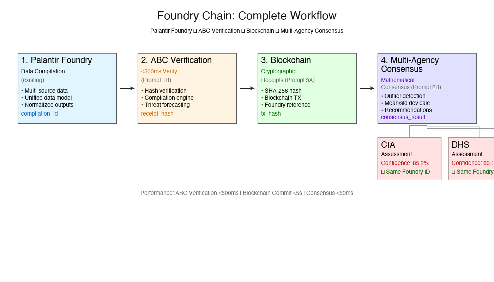

# ABC Architecture Specification

**Adversarial Behavior Compiler v2.0 - Full Technical Specification**

Copyright (c) 2025 GH Systems. All rights reserved.

---

> **For a non-technical overview, see [Beginner Guide](../BEGINNER_GUIDE.md)**

---

## Overview

This document provides the complete technical specification for the ABC (Adversarial Behavior Compiler) system. 

**For business context and use cases, see [Use Cases](../USE_CASES.md).**

For a quick overview, see the [main README](../../README.md). For a non-technical introduction, see the [Beginner Guide](../BEGINNER_GUIDE.md).

---

## What ABC Is: Foundry's Chainlink

**ABC is the verification layer for Palantir Foundry—the Chainlink for government intelligence.**

Just as Chainlink solved Ethereum's oracle problem (can't trust off-chain data), ABC solves Foundry's verification problem (can't verify conflicting AI assessments).

### The Problem: Agency AI Systems Disagree

```
Palantir Foundry compiles intelligence → CIA AI: 85% confidence
                                      → DHS AI: 60% confidence
                                      → Treasury AI: 72% confidence

Question: Did they analyze the same data? No way to verify.

Result: 14 days to manually reconcile conflicts.
```

### The Solution: ABC Verification Layer

```
Palantir Foundry compiles → ABC verifies & commits to blockchain → Agencies query ABC
        ↓                            ↓                                      ↓
  Data integration          Cryptographic proof                    Verified intelligence
  Multi-source              <500ms verification                    Same source data
  Normalized                Blockchain receipt                     Mathematical consensus
```

**ABC doesn't compete with Foundry—it makes Foundry unstoppable.**

When CIA and DHS get different results from the same Foundry compilation, ABC provides cryptographic proof they analyzed the same source data. The disagreement is methodology, not data quality.

### The Chainlink Parallel

| Ethereum | Chainlink | Palantir Foundry | ABC |
|----------|-----------|------------------|-----|
| Smart contracts need off-chain data | Decentralized oracle network | Intelligence platform needs verification | Verification layer |
| Can't trust data sources | Cryptographic proof | Can't verify AI conflicts | Blockchain receipts |
| $10B+ market cap | Multi-party consensus | $40B+ valuation | Multi-agency consensus |

**Impact:** ABC is to Foundry what Chainlink is to Ethereum—the verification infrastructure that makes the platform trustworthy in the post-AGI era.

---

## Three Core Advantages

### 1. Faster, Crypto-Native Payment Settlement

**4-hour settlement vs. 18-month procurement cycles**

- **Fiat-compatible interface**: Government clients pay in USD (FAR-compliant)
- **Bitcoin settlement to vendors**: Oracle/custodial service converts fiat to BTC
- **Automated payouts**: Vendors receive BTC when intelligence validates
- **No government hot wallets required**: Compliant intermediary handles conversion

**Note:** Bitcoin settlement is a capability, not a rigid requirement. The system supports fiat-to-BTC conversion via compliant oracle/custodial services (e.g., Prime, Coinbase Prime) for government clients who cannot hold Bitcoin directly.

**Impact:** Treasury posts USD payment; Oracle converts to BTC; vendor receives settlement within 4 hours (vs. 18-month traditional procurement).

---

### 2. Intelligence Compiler Shortens Investigation Time

**7 days → ~5 hours with pre-compiled actor playbooks**

- ABC runtime compiles intelligence in <500ms
- Unified intelligence from multiple vendors
- Automated correlation and pattern matching
- Pre-compiled actor playbooks ready for action

**Crypto-Native Intelligence:**
- Domain-native pattern recognition
- Decentralized signal analysis
- Attacker mindset modeling

**Impact:** Analysts reduced triage from 7 days to ~5 hours with compiled actor packages. Fills gaps legacy teams can't cover, especially in conflicts where crypto is used for financing, intelligence, or infrastructure attacks.

---

### 3. Cryptographically Provable Scores

**Cryptographic receipts make intelligence provable without revealing proprietary methods**

- Risk scores, behavioral signatures, and threat assessments verifiable on-chain
- Proof of authenticity without revealing proprietary methodology
- Intelligence becomes verifiable objects usable everywhere

**On-Chain Proof Layer:**
- Outputs are auditable
- Multi-party collaboration is feasible
- Evidence remains tamper-resistant

**Impact:** Intelligence becomes portable, trustworthy, and usable in any system. Enables trust without revealing proprietary systems. Invaluable in regional conflicts where credibility, attribution, and speed are crucial.

---

## How ABC Works: The Foundry Verification Pipeline

### Complete Workflow Visualization

<div align="center">
  
  <p><em>Complete workflow: Palantir Foundry → ABC Verification → Blockchain → Multi-Agency Consensus</em></p>
</div>

**See also:** [Foundry Chain Visual Documentation](../integrations/FOUNDRY_CHAIN_VISUAL.md) for detailed diagrams and process flows.

### Step 1: Foundry Compilation

```
Palantir Foundry:

├── Ingest: Chainalysis, TRM Labs, OFAC, agency databases
├── Normalize: Unified data model
├── Compile: Single intelligence package
└── Output: foundry-comp-2025-12-15-001
    ├── data_hash: sha256:abc123...
    ├── classification: SBU
    └── timestamp: 2025-12-15T17:00:00Z
```

### Step 2: ABC Verification & Blockchain Commitment

```
ABC Verification Layer:

├── Ingest: Foundry compilation (via API)
├── Verify: Hash matches, sources validated
├── Analyze: Hades/Echo/Nemesis AI analysis (<500ms)
├── Generate: Cryptographic receipt
└── Commit: Blockchain (Bitcoin/Ethereum/Hyperledger)
    ├── Foundry hash: sha256:abc123...
    ├── ABC analysis hash: sha256:def456...
    ├── Confidence: 88.4%
    └── Blockchain TX: 0x789...
```

### Step 3: Agency AI Systems Query ABC

```
CIA AI System:

├── Query: "What's the verified intelligence for foundry-comp-2025-12-15-001?"
├── ABC Response: Verified data + blockchain receipt
├── CIA runs proprietary AI on verified data
└── CIA commits assessment to blockchain (references ABC receipt)

DHS AI System:

├── Query: Same Foundry compilation
├── ABC Response: Same verified data (cryptographic proof)
├── DHS runs proprietary AI
└── DHS commits assessment (references same ABC receipt)
```

### Step 4: Multi-Agency Consensus Dashboard

```
Genesis Mission Dashboard:

├── Foundry Source: foundry-comp-2025-12-15-001 ✓ (verified by ABC)
├── ABC Baseline: 88.4% confidence ✓ (blockchain receipt: 0x789...)
├── Agency Assessments:
│   ├── CIA: 85.2% ✓ (references ABC receipt 0x789...)
│   ├── DHS: 60.1% ⚠️ (references ABC receipt 0x789...)
│   └── Treasury: 72.5% ✓ (references ABC receipt 0x789...)
├── Verification: All agencies analyzed SAME source data (cryptographic proof)
└── Recommendation: Investigate DHS methodology (not data quality)
```

### The ABC Intelligence Pipeline

1. **Foundry Integration** — Ingest Palantir Foundry compilations via API
2. **Hades** — Compile raw telemetry into actor signatures & risk posture
3. **Echo** — Surface coordination networks with confidence/provenance
4. **Nemesis** — Generate executable targeting packages ("freeze Exchange_A/B within 24h; confidence 0.84")
5. **Cryptographic receipts** — Generate minimal on-chain proofs linking Foundry → ABC → Blockchain
6. **Agency Oracle** — Agencies query ABC for verified intelligence, submit assessments
7. **Consensus Engine** — Calculate multi-agency consensus, detect outliers, generate recommendations
8. **Output** — APIs, mesh connectors, or air-gapped delivery for Treasury, OFAC, FinCEN, DoD Cyber Command, allies

**Hypnos Core** is the long-term memory system that structures intelligence. Built on Hypnos Core, Hades profiles behavior, Echo detects coordination, and Nemesis generates targeting packages. Hypnos Core maintains long-term memory, consolidates patterns, and tracks dormant threats (see `hypnos/` for details).

### On-Chain Strategy

**Everything proprietary stays off-chain. Only tiny cryptographic proofs go on-chain.**

- **Off-Chain:** All AI models, full intelligence packages, proprietary systems, Foundry compilations
- **On-Chain:** Minimal cryptographic receipts (hash, timestamp, signature, Foundry reference, minimal metadata)

This turns intelligence into **verifiable objects** that can be used everywhere—beyond settlements, into workflows. Intelligence becomes portable, trustworthy, and usable in any system.

### Tiered Security Model for Government Deployments

ABC implements a three-tier security classification system for on-chain commitments, ensuring compliance with government security requirements:

#### Tier 1: Unclassified

- **Blockchains:** Public chains (Bitcoin, Ethereum, Polygon, Arbitrum, Base, Optimism)
- **Data Exposure:** Full intelligence hash and metadata committed
- **Verification:** Public, anyone can verify
- **Use Case:** Public threat intelligence, unclassified assessments

#### Tier 2: SBU (Sensitive But Unclassified)

- **Blockchains:** Permissioned chains (Hyperledger, Corda, Quorum, Besu)
- **Data Exposure:** Controlled access, encrypted metadata
- **Verification:** Permissioned, authorized parties only
- **Use Case:** Sensitive but unclassified intelligence, Foundry compilations

#### Tier 3: Classified

- **Blockchains:** Any (Bitcoin, Ethereum for hash-only commitments)
- **Data Exposure:** Zero - only cryptographic hash committed
- **Verification:** Hash-only verification
- **Use Case:** Classified intelligence, zero data exposure

**Implementation:**

- Automatic tier determination from classification strings
- Blockchain validation ensures compatibility with selected tier
- Tier-appropriate commitment strategies (hash-only for Tier 3)
- Integrated into CLI tools, API endpoints, and compilation engine

This tiered approach enables ABC to handle Foundry compilations and agency assessments across all classification levels while maintaining cryptographic verifiability and compliance with government security standards.

---

## AI-Powered Threat Ontology

ABC is not just a compiler—it's an **AI-powered threat ontology** that:

- **Learns** – Semantic understanding extracts entities from unstructured intelligence
- **Classifies** – Auto-classification categorizes threat actors, TTPs, and campaigns
- **Infers** – Graph neural networks discover hidden relationships
- **Predicts** – Forecasts adversary actions before they occur
- **Evolves** – Continuous learning improves from feedback and new data

See `nemesis/AI_THREAT_ONTOLOGY_SPEC.md` for complete architecture.

---

## Validated Results

- **100% OFAC wallet detection** – Flagged 3–6 months before public sanction designation
- **Investigation compression** – Analysts reduced triage from 7 days to ~5 hours with compiled actor packages
- **Risk reduction (modeled)** – Treasury desks projected up to 50% lower DeFi exposure once Hades and Nemesis throttled high-risk interactions
- **Inter-agency ROI (pilot estimate)** – Federated mesh users observed 37% fewer duplicated investigations and 22% less capital-at-risk
- **Bitcoin bounty validation** – Treasury posted 10 BTC bounty; ABC submitted package; funds released automatically within 4 hours (vs. 18-month traditional procurement)
- **AI-Powered Threat Ontology** – ABC now learns, evolves, and provides deeper intelligence than rule-based systems
- **On-Chain Cryptographic Receipts** – Everything proprietary stays off-chain. Only minimal cryptographic proofs go on-chain, turning intelligence into verifiable objects
- **Intelligence audits** – `examples/intelligence_audits/` provide systematic threat assessments in audit format

---

## Expanding Beyond Crypto

**Future Bet:** We're betting crypto becomes infrastructure for warfare—autonomous systems, weapons, and infrastructure that run on Bitcoin.

**Proof-of-Concept:** Federal AI security intelligence dossiers (NASA-001, DoD-DHS-002) demonstrate compilation capability for government AI infrastructure vulnerabilities. This positions GH Systems for intelligence in battlefields where crypto connects cyber and physical domains.

See `examples/intelligence_audits/INTELLIGENCE_AUDIT_DOD_DHS_002.md` and `examples/intelligence_audits/THREAT_DOSSIER_NASA_001.md` for examples.

---

## Integration & Commercial Models

### Palantir Foundry Partnership (Primary Strategy)

**ABC is Foundry's Chainlink—the verification layer that makes Foundry unstoppable.**

#### Value Proposition for Palantir

- **Problem:** Agencies blame Foundry when AI assessments conflict
- **Solution:** ABC provides cryptographic proof Foundry delivered correct data
- **Value:** "It's not Foundry's fault—agencies analyzed it differently"

#### Revenue Model

```
Foundry alone: $10M contract
Foundry + ABC: $12M contract (20% uplift)
Palantir's cut: $10M (same)
ABC's cut: $2M (new revenue)
```

**Win-win:** Palantir gets bigger contracts, ABC gets 20% of the uplift.

#### Go-to-Market Timeline

- **Month 1-3:** Palantir partnership, Foundry API integration
- **Month 4-6:** 3-5 agency pilots (NASA, DoD, Treasury, DHS)
- **Month 7-12:** Production rollout, FedRAMP certification
- **Year 2:** $50M+ ARR, 10+ agencies, 50+ oracle nodes

### Alternative Integration Models

GH Systems does not compete with existing vendors—it amplifies them.

- **White-label license** ($100K–$300K/yr) → vendors upsell predictive intelligence (e.g., $2M → $3.5M contracts, ROI >600%)
- **Revenue-share overlay** (~30% of contract uplift) → no upfront cost for research firms
- **Strategic partnerships** → joint bids combining forensics + behavioral targeting (e.g., $5M contracts)
- **Palantir revenue share** (20% of incremental Foundry contracts) → ABC verification layer add-on

**Time to value:** 1–2 months for API/schema alignment, 2–3 months for live pilot, enhanced contracts by month 6.

### Integration Scenarios

- **Foundry Verification** – Palantir sells "Foundry + ABC" bundle; ABC gets 20% of incremental revenue; agencies get cryptographic verification
- **Performance Bounty** – Treasury posts 10 BTC bounty; ABC submits validated package; funds release automatically within 4 hours (vs. 18-month procurement cycle)
- **Vendor Revenue Share** – Chainalysis $2M contract → $3.5M with ABC; split 70/30; quarterly BTC settlements
- **Allied Coordination Fund** – US Treasury + UK FIU + EU AML establish 100 BTC joint pool; 2-of-3 multisig payouts for cross-border intelligence

### Why Integrate Now: FY2026 Competitive Window

- **Q4 2025 (now):** FY2026 contract decisions underway. First vendor integrating ABC wins premium contracts; others remain forensic-only
- **Q1 2026:** FY2026 awards finalized—too late to integrate; late adopters wait until FY2027 (18-month disadvantage)
- **Integration timeline:** 4–6 months (API alignment + pilot). Decisions by December 2025 capture FY2026 renewal cycle

**Window for competitive advantage:** immediate through FY2026 decisions (12–18 months head start). After awards, predictive intelligence becomes expected, not premium.

---

## Current Status

**This repository represents the v2.0 architecture currently under development.**

### Implemented ✅

- **Core ingestion pipeline**: Pydantic schemas and validation (`src/schemas/`, `core/ingestion/validator.py`)
- **API endpoints**: FastAPI routes with error handling (`src/api/routes/ingest.py`, `src/api/routes/foundry.py`)
- **Graph data structures**: NetworkX-based graph manipulation (`src/graph/builder.py`)
- **Fiat bridge**: FAR-compliant settlement system (`settlements/fiat_bridge.py`)
- **Cryptographic receipts**: Canonical JSON hashing and Merkle trees (`nemesis/on_chain_receipt/`)
- **AI ontology guardrails**: Data lake, validation layer, review queue, heuristic rules (`nemesis/ai_ontology/`)
- **Tiered Security Model**: Three-tier security classification system for government deployments (`nemesis/on_chain_receipt/security_tier.py`)
  - Tier 1 (Unclassified): Public blockchains, full data visibility
  - Tier 2 (SBU): Permissioned chains, controlled access
  - Tier 3 (Classified): Hash-only commitments, zero data exposure
- **Chain-Agnostic Architecture**: Support for Bitcoin, Ethereum, Polygon, Arbitrum, Base, Optimism
- **Foundry Connector**: Push ABC data to Palantir Foundry (`src/integrations/foundry/connector.py`)
- **Foundry Chain Integration**: Complete verification pipeline (Foundry → ABC → Blockchain → Consensus)
  - Foundry compilation ingestion (`src/integrations/foundry/connector.py`)
  - ABC verification endpoint (`src/api/routes/foundry.py`)
  - Receipt verification with Foundry references (`src/core/nemesis/on_chain_receipt/receipt_generator.py`)
  - Agency assessment API (`src/api/routes/agency.py`)
  - Consensus calculation engine (`src/consensus/engine.py`)
- **Vector Database Integration**: Long-term memory and semantic search (FAISS/Qdrant backends)
- **Real-Time Dashboard**: PostgreSQL-backed dashboard with historical metrics and Chart.js visualizations
- **Kubernetes Deployment**: Production-ready K8s manifests with HA, auto-scaling, monitoring (`k8s/`)
- **Performance Optimizations**: Redis caching layer, Prometheus metrics (`src/core/middleware/cache.py`)

### In Development 🚧

- **GNN inference engine**: Graph neural network relationship inference (currently using heuristic rules)
- **Production deployment**: Full containerization and orchestration (Docker, Kubernetes, CI/CD)
- **Receipt verification**: Full blockchain query implementation for receipt chain verification

### Planned 📋

- **Full GNN implementation**: Replace heuristic rules with trained models
- **Multi-modal intelligence**: Text, transaction, graph, and temporal data processing
- **Federated mesh**: Multi-party intelligence sharing with cryptographic proofs

**We're honest about what works and what's being built. The core compilation pipeline is production-ready; advanced AI features are in active development.**

---

*GH Systems — Compiling behavioral bytecode so lawful actors win the economic battlefield.*
