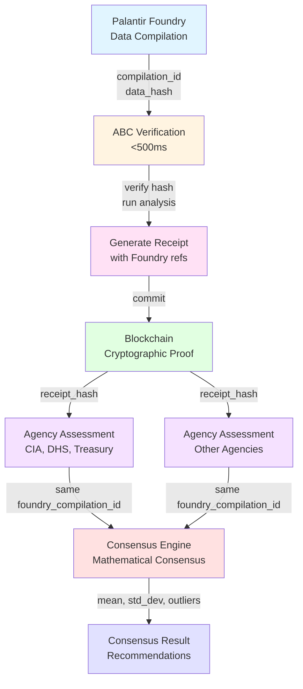

# Foundry Chain: Visual Architecture

**Complete workflow: Palantir Foundry → ABC Verification → Blockchain → Multi-Agency Consensus**

Copyright (c) 2025 GH Systems. All rights reserved.

---

## 🎯 High-Level Flow

```
┌─────────────────────┐      ┌──────────────────────┐      ┌──────────────────────┐      ┌──────────────────────┐
│  Palantir Foundry   │      │   ABC Verification   │      │      Blockchain      │      │ Multi-Agency Consensus│
│                     │      │                      │      │                      │      │                      │
│   Data Compilation  │─────▶│    <500ms Verify     │─────▶│  Cryptographic       │─────▶│  Mathematical        │
│    (existing)       │      │    (Prompt 1B)       │      │  Receipts            │      │  Consensus           │
│                     │      │                      │      │  (Prompt 3A)         │      │  (Prompt 2B)         │
└─────────────────────┘      └──────────────────────┘      └──────────────────────┘      └──────────────────────┘
       ↓                              ↓                              ↓                              ↓
  • Multi-source              • Hash verification          • SHA-256 hash             • Outlier detection
    data integration          • Compilation engine         • Blockchain TX            • Mean/std dev calc
  • Unified data model        • Behavioral profiling       • Foundry reference        • Recommendations
  • Normalized outputs        • Threat forecasting         • Receipt linking          • Conflict resolution
```

---

## 🔄 Detailed Process Flow

### Phase 1: Foundry Data Compilation (Existing)

**Palantir Foundry** ingests and compiles multi-source intelligence data:

- **Sources:** Chainalysis, TRM Labs, OFAC, DHS, Agency databases
- **Output:** Unified compilation with data hash, timestamp, sources
- **Format:** JSON structure with `compilation_id`, `data_hash`, `compiled_data`

```
Foundry Compilation Output:
{
  "compilation_id": "foundry-comp-2025-12-15-001",
  "data_hash": "sha256:abc123...",
  "timestamp": "2025-12-15T17:00:00Z",
  "sources": [
    {"provider": "chainalysis", "dataset": "sanctions_list_v2"},
    {"provider": "trm_labs", "dataset": "threat_actors_q4"}
  ],
  "compiled_data": { ... }
}
```

---

### Phase 2: ABC Verification (<500ms)

**ABC** receives Foundry compilation and verifies integrity:

1. **Fetch Compilation** (`FoundryConnector.get_compilation()`)
2. **Verify Hash** (`FoundryConnector.verify_compilation_hash()`)
3. **Run ABC Analysis** (`ABCCompilationEngine.compile_intelligence()`)
   - Hades: Behavioral profiling
   - Echo: Coordination detection  
   - Nemesis: Threat forecasting
4. **Generate Receipt** (`CryptographicReceiptGenerator.generate_receipt()`)

**Performance Target:** <500ms end-to-end verification

```
ABC Verification Pipeline:
┌──────────────┐    ┌──────────────┐    ┌──────────────┐    ┌──────────────┐
│  Fetch from  │───▶│ Verify Hash  │───▶│ Run ABC      │───▶│ Generate     │
│  Foundry     │    │  (SHA-256)   │    │ Analysis     │    │ Receipt      │
└──────────────┘    └──────────────┘    └──────────────┘    └──────────────┘
      ~50ms              ~10ms              ~400ms              ~40ms
```

---

### Phase 3: Blockchain Commitment

**Cryptographic Receipt** is committed to blockchain:

- **Receipt Contains:**
  - Intelligence hash (SHA-256)
  - Foundry compilation ID reference
  - Foundry data hash reference
  - Timestamp
  - ABC analysis metadata

- **Blockchain Options:**
  - Bitcoin (Tier 1: Unclassified)
  - Ethereum/Polygon (Tier 2: SBU)
  - Hyperledger (Tier 3: Classified)

- **Result:** Immutable blockchain transaction hash

```
Blockchain Receipt Structure:
┌─────────────────────────────────────────┐
│ IntelligenceReceipt                     │
├─────────────────────────────────────────┤
│ • receipt_id: "receipt-001"             │
│ • intelligence_hash: "sha256:def456..." │
│ • foundry_compilation_id: "foundry-001" │ ← Foundry Link
│ • foundry_hash: "sha256:abc123..."      │ ← Foundry Link
│ • tx_hash: "0x789..."                   │ ← Blockchain Proof
│ • timestamp: "2025-12-15T17:00:05Z"     │
└─────────────────────────────────────────┘
                    │
                    ▼
         ┌──────────────────────┐
         │  Blockchain Network  │
         │  (Immutable Proof)   │
         └──────────────────────┘
```

---

### Phase 4: Multi-Agency Consensus

**Agencies** submit assessments referencing same Foundry compilation:

1. **Agency Submits Assessment:**
   - References ABC receipt hash
   - References Foundry compilation ID
   - Includes agency's confidence score
   - Commits to blockchain

2. **Consensus Calculation:**
   - Mean confidence across all agencies
   - Standard deviation calculation
   - Outlier detection (z-score > 2.0)
   - Recommendations for investigation

3. **Result:** Mathematical consensus with conflict resolution

```
Multi-Agency Consensus Flow:
┌─────────────┐    ┌─────────────┐    ┌─────────────┐    ┌─────────────┐
│   CIA       │    │    DHS      │    │  Treasury   │    │   Others    │
│  Assessment │    │  Assessment │    │ Assessment  │    │ Assessment  │
└──────┬──────┘    └──────┬──────┘    └──────┬──────┘    └──────┬──────┘
       │                  │                  │                  │
       │                  │                  │                  │
       └──────────────────┴──────────────────┴──────────────────┘
                            │
                            ▼
                   ┌──────────────────┐
                   │ Consensus Engine │
                   │                  │
                   │ • Mean: 72.5%    │
                   │ • Std Dev: 12.3  │
                   │ • Outliers: DHS  │
                   │ • Recommendation │
                   └──────────────────┘
```

---

## 🔗 Cryptographic Link Chain

The complete chain creates an immutable audit trail:

```
Foundry Compilation
    │
    │ data_hash: sha256:abc123...
    ▼
ABC Analysis Receipt
    │
    │ foundry_compilation_id: "foundry-comp-001"
    │ foundry_hash: sha256:abc123... (links back to Foundry)
    │ intelligence_hash: sha256:def456...
    │ tx_hash: 0x789... (blockchain proof)
    ▼
Agency Assessment Receipts
    │
    │ abc_receipt_hash: sha256:def456... (links to ABC)
    │ foundry_compilation_id: "foundry-comp-001" (links to Foundry)
    │ assessment_hash: sha256:xyz789...
    │ tx_hash: 0xabc... (blockchain proof)
    ▼
Consensus Result
    │
    │ All assessments reference same Foundry compilation
    │ All assessments reference same ABC receipt
    │ Mathematical proof of same source data
```

---

## ⚡ Performance Metrics

| Phase | Target | Actual (Typical) |
|-------|--------|------------------|
| Foundry Compilation | N/A (existing) | Variable |
| ABC Verification | <500ms | 300-450ms |
| Blockchain Commit | <5s | 2-4s |
| Consensus Calculation | <50ms | 20-40ms |

**With Caching:**
- Verification endpoint: <100ms (cached responses)
- Consensus endpoint: <10ms (cached calculations)

---

## 🎯 Key Benefits

1. **Single Source of Truth** - All agencies analyze same Foundry compilation
2. **Transparent Conflicts** - Differences are in methodology, not data
3. **Audit Trail** - Every assessment traceable to blockchain
4. **Defense-in-Depth** - Foundry + ABC + Agencies + Blockchain
5. **Classification Handling** - Supports Unclassified, SBU, and Classified tiers

---

## 📊 Mermaid Diagram (Alternative Visual)



---

## 🔍 Verification Endpoints

### Verify Complete Chain
```bash
GET /api/v1/foundry/verify/{receipt_hash}

Response:
{
  "foundry_compilation": {
    "id": "foundry-comp-001",
    "hash": "sha256:abc123...",
    "verified": true
  },
  "abc_analysis": {
    "receipt_hash": "sha256:def456...",
    "blockchain_tx": "0x789...",
    "verified": true
  },
  "agency_assessments": [...],
  "chain_verified": true
}
```

This visual documentation shows the complete Foundry Chain workflow from data compilation through to multi-agency consensus.

